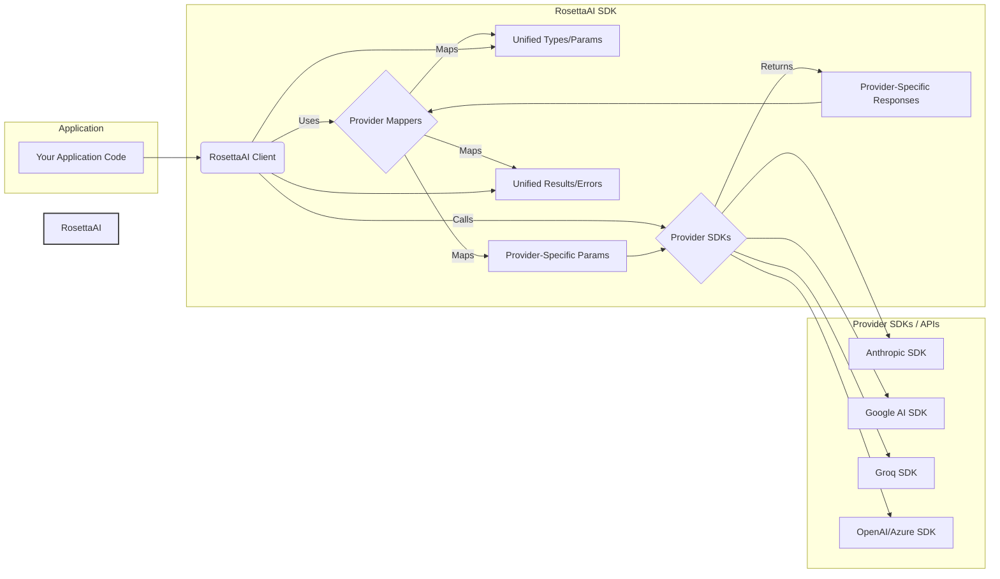

# RosettaAI SDK

[](https://opensource.org/licenses/MIT)

**RosettaAI** is a powerful TypeScript SDK designed to provide a unified interface for interacting with multiple AI providers. Simplify your AI integration process by using a single, consistent API for services like Anthropic, Google Generative AI, Groq, OpenAI, and Azure OpenAI.

Built for Node.js v20+ and TypeScript v5.5+, RosettaAI prioritizes type safety, robustness, and modern development practices.

| Feature             | OpenAI (Azure) | Anthropic | Google | Groq | Notes                                  |
| :------------------ | :------------: | :-------: | :----: | :--: | :------------------------------------- |
| Chat (Generate)     |       ✅       |    ✅     |   ✅   |  ✅  |                                        |
| Chat (Stream)       |       ✅       |    ✅     |   ✅   |  ✅  |                                        |
| Image Input         |       ✅       |    ✅     |   ✅   |  ⚠️  | Groq support varies by model           |
| Tool Use            |       ✅       |    ✅     |   ✅   |  ✅  | Implementation details differ slightly |
| Embeddings          |       ✅       |    ❌     |   ✅   |  ✅  | Anthropic has no public embedding API  |
| JSON Mode           |       ✅       |    ❌     |   ⚠️   |  ⚠️  | OpenAI/Azure best; others via prompt   |
| Grounding/Citations |       ❌       |    ❌     |   ✅   |  ❌  | Via Google Search tool integration     |
| Thinking Steps      |       ❌       |    ✅     |   ❌   |  ❌  | Anthropic specific feature             |
| TTS                 |       ✅       |    ❌     |   ❌   |  ❌  | Via OpenAI/Azure Audio API             |
| STT                 |       ✅       |    ❌     |   ⚠️   |  ✅  | Google requires separate Speech client |
| STT (Translate)     |       ✅       |    ❌     |   ❌   |  ✅  | To English                             |

✅ = Supported | ⚠️ = Partial/Limited/Via Prompting | ❌ = Not Supported

## Table of Contents

- [Features](#features)
- [Supported Providers](#supported-providers)
- [Installation](#installation)
- [Configuration](#configuration)
  - [Environment Variables](#environment-variables)
  - [Constructor Options](#constructor-options)
- [Basic Usage](#basic-usage)
  - [Chat Completion](#chat-completion)
  - [Streaming Chat](#streaming-chat)
  - [Embeddings](#embeddings)
  - [Text-to-Speech (TTS)](#text-to-speech-tts)
  - [Speech-to-Text (STT)](#speech-to-text-stt)
  - [Image Input](#image-input)
- [Examples](#examples)
- [Architecture](#architecture)
- [Extensibility: Adding New Providers](#extensibility-adding-new-providers)
- [License](#license)

## Features

- **Unified API:** Interact with multiple AI providers through a single, consistent interface.
- **Provider Abstraction:** Switch between providers (e.g., OpenAI to Anthropic) with minimal code changes.
- **Chat Completions:** Generate text-based responses in conversational format.
- **Tool Use (Function Calling):** Define tools and let the model decide when to call them.
- **Image Input (Multimodal):** Send images along with text prompts to multimodal models.
- **Streaming Support:** Handle real-time responses efficiently with async iterators.
- **Text-to-Speech (TTS):** Synthesize text into spoken audio (currently via OpenAI).
- **Speech-to-Text (STT):** Transcribe or translate audio files into text (currently via OpenAI, Groq).
- **Embeddings:** Generate vector embeddings for text using supported providers.
- **Error Handling:** Maps provider-specific errors to standardized `RosettaAIError` types.
- **Configuration:** Flexible configuration via environment variables or constructor options.
- **Modern Stack:** Built for Node.js v20+ and TypeScript v5.5+.
- **Type Safety:** Leverages TypeScript for robust type checking and improved developer experience.

## Supported Providers

- [Anthropic](https://www.anthropic.com/) (Claude models)
- [Google Generative AI](https://ai.google.dev/) (Gemini models)
- [Groq](https://groq.com/) (Llama, Mixtral models via GroqCloud)
- [OpenAI](https://openai.com/) (GPT models)
- [Azure OpenAI Service](https://azure.microsoft.com/en-us/products/ai-services/openai-service)

## Installation

```bash
npm install rosetta-ai-sdk
# or
yarn add rosetta-ai-sdk
```

Ensure you have Node.js v20 or later installed.

## Configuration

You can configure the SDK using environment variables or by passing a configuration object to the `RosettaAI` constructor.

### Environment Variables

Copy the `.env.example` file to `.env` and fill in the API keys for the providers you intend to use:

```dotenv
# .env

# --- Required API Keys ---
ANTHROPIC_API_KEY=your_anthropic_api_key
GOOGLE_API_KEY=your_google_api_key
GROQ_API_KEY=your_groq_api_key
OPENAI_API_KEY=your_openai_api_key # For standard OpenAI

# --- Azure OpenAI (Alternative to Standard OpenAI) ---
# AZURE_OPENAI_API_KEY=your_azure_openai_api_key
# AZURE_OPENAI_ENDPOINT=https://your-resource-name.openai.azure.com/
# AZURE_OPENAI_DEPLOYMENT_NAME=your-chat-deployment-name
# ROSETTA_AZURE_OPENAI_EMBEDDING_DEPLOYMENT_NAME=your-embedding-deployment-name
# AZURE_OPENAI_API_VERSION=2024-05-01-preview

# --- Optional Defaults ---
# ROSETTA_DEFAULT_ANTHROPIC_MODEL=claude-3-haiku-20240307
# ROSETTA_DEFAULT_GOOGLE_MODEL=gemini-1.5-flash-latest
# ROSETTA_DEFAULT_GROQ_MODEL=llama3-8b-8192
# ROSETTA_DEFAULT_OPENAI_MODEL=gpt-4o-mini
# ... other defaults (see .env.example)
```

The SDK automatically loads variables from `.env` using `dotenv`.

### Constructor Options

Alternatively, pass configuration directly to the constructor. This overrides environment variables.

```typescript
import { RosettaAI, Provider } from "rosetta-ai-sdk";

const config = {
  openaiApiKey: "sk-your-key",
  anthropicApiKey: "sk-ant-your-key",
  // Azure configuration (if used)
  azureOpenAIApiKey: "azure-key",
  azureOpenAIEndpoint: "https://your-resource.openai.azure.com/",
  azureOpenAIApiVersion: "2024-05-01-preview",
  azureOpenAIDefaultChatDeploymentName: "my-gpt4-deployment",
  // Default models
  defaultModels: {
    [Provider.OpenAI]: "gpt-4o-mini",
    [Provider.Anthropic]: "claude-3-sonnet-20240229",
  },
  defaultEmbeddingModels: {
    [Provider.OpenAI]: "text-embedding-3-small",
  },
  // Optional provider-specific settings
  providerOptions: {
    [Provider.OpenAI]: {
      // Example: Override Azure deployment for a specific call later
      // azureChatDeploymentId: 'another-deployment'
    },
  },
};

const rosetta = new RosettaAI(config);
```

## Basic Usage

Import the necessary components and initialize the client:

```typescript
import {
  RosettaAI,
  Provider,
  RosettaMessage,
  EmbedParams,
  SpeechParams,
  TranscribeParams,
} from "rosetta-ai-sdk";
import dotenv from "dotenv";

// Load .env file if using environment variables
dotenv.config();

const rosetta = new RosettaAI(); // Uses env vars or pass config object
```

### Chat Completion

```typescript
async function basicChat() {
  try {
    const result = await rosetta.generate({
      provider: Provider.OpenAI, // Or Provider.Anthropic, Provider.Google, Provider.Groq
      // model: 'gpt-4o-mini', // Optional: Defaults defined in config/env
      messages: [
        { role: "system", content: "You are a helpful assistant." },
        { role: "user", content: "What is the capital of France?" },
      ],
      maxTokens: 50,
    });

    console.log("Response:", result.content);
    console.log("Finish Reason:", result.finishReason);
    console.log("Usage:", result.usage);
  } catch (error) {
    console.error("Chat Error:", error);
  }
}

basicChat();
```

### Streaming Chat

```typescript
async function streamingChat() {
  try {
    const stream = rosetta.stream({
      provider: Provider.Anthropic,
      // model: 'claude-3-haiku-20240307', // Optional
      messages: [
        { role: "user", content: "Write a short poem about streams." },
      ],
      maxTokens: 100,
    });

    console.log("Streaming Response:");
    for await (const chunk of stream) {
      if (chunk.type === "content_delta") {
        process.stdout.write(chunk.data.delta);
      } else if (chunk.type === "message_stop") {
        console.log(
          `\n--- Stream Stopped (Reason: ${chunk.data.finishReason}) ---`
        );
      } else if (chunk.type === "final_usage") {
        console.log("\nFinal Usage:", chunk.data.usage);
      } else if (chunk.type === "error") {
        console.error("\nStream Error:", chunk.data.error);
        break; // Stop processing on stream error
      }
    }
    console.log("\n--- End of Stream ---");
  } catch (error) {
    // Errors during stream setup (e.g., auth) are caught here
    console.error("Stream Setup Error:", error);
  }
}

streamingChat();
```

### Embeddings

```typescript
async function getEmbeddings() {
  try {
    const params: EmbedParams = {
      provider: Provider.OpenAI, // Or Provider.Google, Provider.Groq
      // model: 'text-embedding-3-small', // Optional
      input: [
        "RosettaAI simplifies AI integration.",
        "Embeddings represent text numerically.",
      ],
    };
    const result = await rosetta.embed(params);

    console.log(`Generated ${result.embeddings.length} embeddings.`);
    result.embeddings.forEach((vec, i) => {
      console.log(
        `  Embedding ${i + 1} (dim: ${vec.length}): [${vec
          .slice(0, 4)
          .join(", ")}...]`
      );
    });
    console.log("Usage:", result.usage);
  } catch (error) {
    console.error("Embedding Error:", error);
  }
}

getEmbeddings();
```

### Text-to-Speech (TTS)

_(Currently supports OpenAI / Azure OpenAI)_

```typescript
import fs from "fs/promises";
import path from "path";

async function generateSpeech() {
  try {
    const params: SpeechParams = {
      provider: Provider.OpenAI,
      // model: 'tts-1', // Optional
      input: "Hello from RosettaAI!",
      voice: "nova", // Choose a voice (e.g., alloy, echo, fable, onyx, nova, shimmer)
      responseFormat: "mp3",
    };
    const audioBuffer = await rosetta.generateSpeech(params);

    const filePath = path.join(__dirname, "output_speech.mp3");
    await fs.writeFile(filePath, audioBuffer);
    console.log(`Speech saved to ${filePath}`);
  } catch (error) {
    console.error("TTS Error:", error);
  }
}

generateSpeech();
```

### Speech-to-Text (STT)

_(Currently supports OpenAI / Azure OpenAI, Groq)_

```typescript
import fs from "fs/promises";
import path from "path";

async function transcribeAudio() {
  const audioFilePath = path.join(__dirname, "output_speech.mp3"); // Use previously generated file or provide your own
  try {
    const audioBuffer = await fs.readFile(audioFilePath);
    const params: TranscribeParams = {
      provider: Provider.OpenAI, // Or Provider.Groq
      // model: 'whisper-1', // Optional
      audio: {
        data: audioBuffer,
        filename: "output_speech.mp3", // Filename is important
        mimeType: "audio/mpeg",
      },
      responseFormat: "text", // Get plain text
    };
    const result = await rosetta.transcribe(params);

    console.log("Transcription:", result.text);
  } catch (error) {
    console.error("STT Error:", error);
  }
}

transcribeAudio();
```

### Image Input

_(Supports OpenAI, Anthropic, Google)_

```typescript
import fs from "fs/promises";
import path from "path";
import { RosettaImageData, ImageMimeType } from "rosetta-ai-sdk";

async function describeImage() {
  const imagePath = path.join(__dirname, "logo.png"); // Provide path to your image

  try {
    const buffer = await fs.readFile(imagePath);
    const base64Data = buffer.toString("base64");
    const mimeType: ImageMimeType = "image/png"; // Adjust based on your image type

    const imageData: RosettaImageData = { mimeType, base64Data };

    const result = await rosetta.generate({
      provider: Provider.OpenAI, // Or Provider.Anthropic, Provider.Google
      // model: 'gpt-4o-mini', // Optional: Use a vision-capable model
      messages: [
        {
          role: "user",
          content: [
            { type: "text", text: "What is shown in this image?" },
            { type: "image", image: imageData },
          ],
        },
      ],
      maxTokens: 100,
    });

    console.log("Image Description:", result.content);
  } catch (error) {
    console.error("Image Input Error:", error);
  }
}

describeImage();
```

## Examples

The `/examples` directory contains more detailed examples demonstrating various features:

- `basic-chat.ts`: Simple non-streaming chat completion across multiple providers.
- `streaming-chat.ts`: Demonstrates handling streaming responses.
- `tool-use.ts`: Shows how to define and use tools (function calling).
- `image-input.ts`: Example of sending images to multimodal models.
- `embeddings.ts`: Generating text embeddings.
- `audio.ts`: Text-to-Speech (TTS) and Speech-to-Text (STT/Translation) examples.
- `structured-output.ts`: Requesting JSON output from models.
- `server.ts` & `index.html`: A simple Express.js backend API server and an interactive HTML frontend that uses the API to showcase all SDK features. Run `npm run dev:server` in the `examples` directory and open `http://localhost:3001` (or your configured port).

**To run the examples:**

1.  Navigate to the `examples` directory: `cd examples`
2.  Install example dependencies: `npm install`
3.  Copy `examples/.env.example` to `examples/.env` and add your API keys.
4.  Run individual examples (e.g., `npm run example:basic`) or the server (`npm run dev:server`). See `examples/package.json` for available scripts.

## Architecture

RosettaAI follows a modular architecture designed for clarity and extensibility:



1.  **RosettaAI Client:** The main entry point for your application. It holds the configuration and orchestrates calls to the appropriate provider.
2.  **Unified Types/Params:** Standardized interfaces (`GenerateParams`, `EmbedParams`, `RosettaMessage`, etc.) used by your application to interact with the SDK.
3.  **Provider Mappers:** (`AnthropicMapper`, `GoogleMapper`, etc.) Implement the `IProviderMapper` interface. Each mapper is responsible for:
    - Translating unified parameters into the specific format required by the target provider's SDK.
    - Translating the provider's response (including errors and stream chunks) back into the unified SDK format.
4.  **Provider SDKs:** The official SDKs for each AI provider (e.g., `@anthropic-ai/sdk`, `openai`). RosettaAI uses these under the hood.
5.  **Unified Results/Errors:** Standardized result objects (`GenerateResult`, `EmbedResult`) and error classes (`ProviderAPIError`, `ConfigurationError`) returned to your application.

## Extensibility: Adding New Providers

Adding support for a new AI provider involves the following steps:

1.  **Define Provider Enum:** Add the new provider to the `Provider` enum in `src/types/common.types.ts`.
2.  **Add Configuration:** Update `RosettaAIConfig` in `src/types/config.types.ts` to include any necessary API keys or configuration options for the new provider. Update the `RosettaAI` constructor in `src/core/rosetta-ai.ts` to load this configuration.
3.  **Install Provider SDK:** Add the official Node.js/TypeScript SDK for the new provider as a dependency to the project.
4.  **Implement Mapper:**
    - Create a new mapper class (e.g., `src/core/mapping/newprovider.mapper.ts`) that implements the `IProviderMapper` interface (`src/core/mapping/base.mapper.ts`).
    - Implement all required methods in the mapper:
      - `mapToProviderParams`: Convert `GenerateParams` to the provider's chat completion parameters.
      - `mapFromProviderResponse`: Convert the provider's chat completion response to `GenerateResult`.
      - `mapProviderStream`: Convert the provider's streaming response chunks to `StreamChunk`.
      - Implement mapping functions for other supported features (embeddings, audio, etc.) or throw `UnsupportedFeatureError` if the provider doesn't support them.
      - `wrapProviderError`: Convert provider-specific errors into `ProviderAPIError` or other relevant `RosettaAIError` subtypes.
5.  **Register Mapper:** In the `RosettaAI` constructor (`src/core/rosetta-ai.ts`), initialize the new provider's client SDK (if an API key is provided) and add an instance of your new mapper to the `this.mappers` map.
6.  **Add Tests:** Write unit tests for your new mapper to ensure correct parameter and result transformations, stream handling, and error wrapping.
7.  **Update Documentation:** Add the new provider to this README and any relevant documentation or examples.

By following this pattern, you can extend RosettaAI to support virtually any AI provider with a Node.js SDK while maintaining a consistent interface for users.

## License

This SDK is licensed under the [MIT License](LICENSE).
